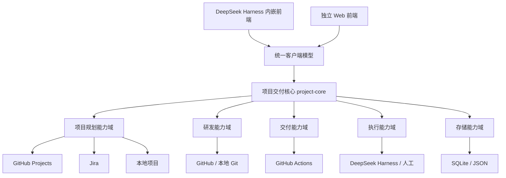
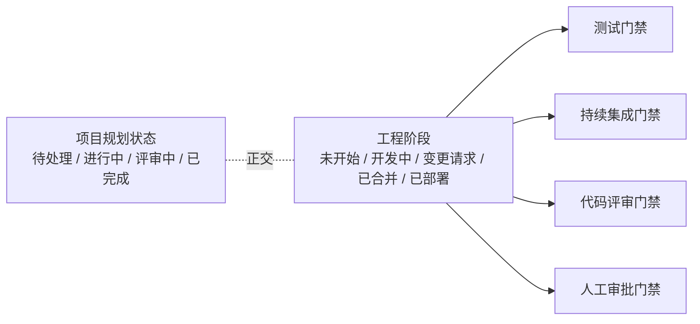
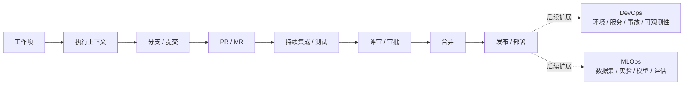
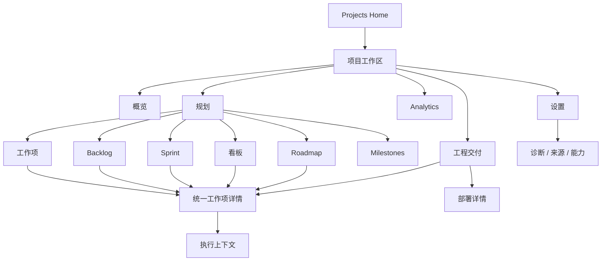
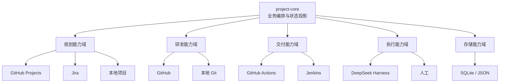
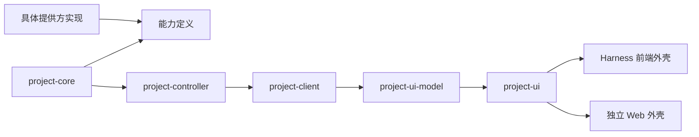

# DeepSeek Harness 项目交付工作台 PRD v0.4

> 状态：需求、架构与视觉交互设计已收敛；下一阶段进入 API、数据库与实现计划  
> 日期：2026-09-17  
> 目标：定义一个面向 DeepSeek Harness 的项目管理与工程交付工作台，在不取代 GitHub Projects、Jira 等事实源的前提下，统一展示规划、开发、验证与交付状态，并与分支、工作树、Agent、测试、评审和审批流程串联。

> v0.4 主要变化：完成核心界面收敛；补齐工作区创建、工作方式、工作项编辑、里程碑、执行上下文、部署、诊断、来源追踪和能力降级；明确 Harness 内嵌与独立 Web 共用业务 UI；修正 GitHub Project 条目与 Issue / PR / Draft 本体不能混为同一领域实体的问题。

---

## 1. TL;DR

本产品不是“另一个 Jira”，也不是“给 DeepSeek Harness 加一个看板”。

它的定位是：

> **把项目规划事实源、代码开发过程、DeepSeek Harness 执行过程和软件交付状态统一投影到一个项目工作空间中，并保持原始系统的事实源地位。**

用户应该能够沿一条连续链路回答五个问题：

1. 应该做什么？
2. 当前正在做什么？
3. 哪些代码实现了它？
4. 是否已经完成测试、评审和审批？
5. 是否真正完成合并、发布或部署？

产品支持两种前端形态：

- DeepSeek Harness 内嵌插件；
- 独立 Web 应用。

二者共享同一套无界面的核心服务、客户端模型和主要界面组件。

首个可用版本只实现：

- 本地项目事实源；
- GitHub Projects；
- 本地 Git；
- GitHub 代码托管；
- DeepSeek Harness Agent 执行；
- GitHub Actions 只读状态；
- 基础部署状态读取；
- Scrum、Kanban、Roadmap、工程交付视图。

Jira、GitLab、Linear、完整 DevOps 与 MLOps 作为后续扩展验证架构，不进入首个版本的核心交付范围。

### 1.1 总体架构概览

图中的“能力域”不是上下游层级，而是可独立替换的能力边界。`project-core` 负责组合这些能力，前端不直接依赖任何具体外部平台。

---

## 2. 产品目标

### 2.1 核心目标

产品应在不复制外部项目管理平台完整能力的前提下，提供以下价值：

- 将不同项目事实源统一映射到一套稳定的项目语义；
- 将工作项与代码开发、Agent 执行、持续集成、评审和部署建立可追踪关系；
- 让项目经理、研发人员和 Agent 在同一个工作空间看到一致的进度事实；
- 保留原始平台对规划状态的所有权；
- 避免使用大语言模型推断关键关系或控制项目状态；
- 允许未来扩展到 DevOps 和 MLOps，而不迫使首个版本承担这些系统的复杂度。

### 2.2 非目标

首个版本不试图：

- 复制 Jira 的完整流程配置能力；
- 复制 GitHub、GitLab 的代码托管能力；
- 复制 Jenkins、Argo CD、Kubernetes 等交付平台；
- 构建复杂的多事实源双向同步系统；
- 构建完整的企业级项目组合管理；
- 使用大语言模型自动判断任务归属、状态转换或关联关系；
- 构建通用低代码流程设计器。

---

## 3. 七条架构不变量

### 3.1 每个工作空间只有一个项目规划事实源

一个项目工作空间在任意时刻只有一个权威的项目规划事实源，例如：

- GitHub Projects；
- Jira；
- Linear；
- 本地数据库。

项目标题、描述、优先级、状态、负责人、迭代、里程碑等字段由该事实源拥有。

首个版本不做 GitHub Projects、Jira、本地数据库之间的实时双向多主同步。

### 3.2 一个工作空间可以连接多个研发与交付提供方

项目规划事实源与研发平台必须解耦。

例如：

- Jira 作为项目规划事实源；
- GitHub 与 GitLab 同时作为代码托管提供方；
- GitHub Actions 与 Jenkins 作为交付状态提供方。

因此“项目规划提供方”和“研发提供方”是两个独立维度。

### 3.3 项目规划状态与工程执行状态正交

项目管理状态描述业务工作到了哪个阶段，例如：

- 待处理；
- 进行中；
- 评审中；
- 已完成。

工程执行状态描述实现和交付发生了什么，例如：

- 已创建工作树；
- Agent 正在运行；
- 已创建 PR；
- 持续集成失败；
- 代码评审已通过；
- 等待人工批准；
- 已合并；
- 已部署。

两者不能压缩为同一个巨大状态枚举。

### 3.4 工程执行采用“阶段 + 并行门禁”模型

工程执行不使用一条线性状态链，而由两类信息组成：

**阶段**：当前工程产物主要处于哪里。

- 未开始；
- 工作空间已准备；
- 开发中；
- 变更请求已创建；
- 已合并；
- 已部署。

**门禁**：多个可以并行变化的质量条件。

- 测试；
- 持续集成；
- 代码评审；
- 人工审批；
- 合并条件。

例如，一个 PR 可以同时处于“代码评审已通过、持续集成失败、等待修复”的组合状态。

项目规划状态属于规划事实源；工程阶段和门禁是交付核心基于工程事实形成的投影。二者可以通过状态策略发生受控联动，但不共享同一个状态枚举。

### 3.5 关键关联显式优先，不依赖大语言模型

项目管理控制路径不依赖大语言模型。

当用户从工作项发起“开始工作”时，应立即显式建立：

工作项 → 执行上下文 → 工作树 → 分支

后续提交、PR、构建和部署尽量沿研发提供方自身的谱系继续传播。

工作项编号出现在分支名、提交信息或 PR 标题中，主要用于跨平台兼容、可读性和确定性校验，而不是让大语言模型重新猜测关联。

### 3.6 工程产物关系沿谱系传播，而不是反复重新识别

典型关系为：

工作项 → 执行上下文 → 分支 → 提交 → PR/MR → 构建 → 部署

如果最前端的工作项关联已经明确，后续节点应优先继承或由提供方原生关系确定。

只有无法获得显式关系时，才允许使用确定性的规则进行辅助发现，并要求用户确认；不引入语义推断。

### 3.7 核心无界面，前端只是消费者

项目核心服务不能依赖 DeepSeek Harness 的界面插件。

产品必须同时支持：

- DeepSeek Harness 内嵌前端；
- 独立 Web 前端；
- 未来的命令行或其他客户端。

权威业务状态始终位于宿主侧核心服务，前端只维护筛选器、选中项、面板宽度等界面私有状态。

---

## 4. 关系语义

### 4.1 为什么“链接”需要语义

工作项与工程产物之间不能只保存“有关联”，还需要知道该关联对任务完成意味着什么。

例如，一个工作项可能同时关联：

- 重构基础设施的 PR；
- 实现主要功能的 PR；
- 添加回归测试的 PR。

它们都有关联，但对“这个工作项是否完成”的意义不同。

首个版本只定义三类工作项—工程产物关系：

| 关系 | 含义 | 是否能够单独支撑工作项完成 |
|---|---|---|
| 引用 | 只表示相关 | 否 |
| 贡献 | 是该工作的一部分 | 否 |
| 解决 | 承担完成该工作项的主要责任 | 可以参与完成判断 |

“解决”并不意味着插件必须自动把工作项置为完成；是否转换项目状态仍由工作空间的状态管理策略决定。

### 4.2 关系来源

每条关系都需要记录来源：

- 提供方原生关系；
- Harness 创建；
- 用户手工创建；
- 确定性规则发现后由用户确认。

首个版本不提供“由大语言模型推断关系”的来源类型。

### 4.3 系统事实关系不需要用户编辑语义

并非所有图中的边都需要“引用 / 贡献 / 解决”。

例如：

- 分支包含提交；
- PR 来源于分支；
- 构建验证某个提交；
- 部署使用某个构建产物。

这些属于研发和交付提供方给出的系统事实，由适配器直接建立。

---

## 5. 生命周期边界

### 5.1 首个版本覆盖工程交付核心

首个版本覆盖：

项目规划 → 工作树 / Agent → 分支 / 提交 → PR/MR → 持续集成 / 测试 → 评审 → 人工审批 → 合并 → 基础发布或部署状态

其中部署只做聚合和展示，不负责操作 Kubernetes、Argo CD、Terraform 等基础设施。

### 5.2 DevOps 扩展方向

后续可以增加：

- 环境；
- 服务；
- 版本；
- 部署历史；
- 事故；
- 健康状态；
- 可观测性摘要。

其目标仍然是“聚合、关联、追踪和编排”，而不是重写现有 DevOps 平台。

### 5.3 MLOps 扩展方向

MLOps 不能被简化为“DevOps 加一个模型字段”。

未来需要额外处理：

数据集 → 实验运行 → 模型版本 → 评估 → 模型注册 → 部署

因此首个版本只预留外部工件和工件关系的扩展机制，不提前建立完整 MLOps 数据模型。

---

## 6. 项目工作方式

项目创建时选择一个**工作方式预设**：

- Scrum；
- Kanban；
- 项目 / Roadmap；
- 基础模式。

预设只决定：

- 默认首页；
- 默认导航；
- 强调字段；
- 少量方法专属设置；
- 默认分析指标。

预设**不创建新的数据模型，不重写外部 Workflow，不删除已有 Sprint、Milestone 或关系**。

同一个项目始终共享相同的工作项、项目条目、迭代、里程碑、关系图和交付谱系。

### 6.1 Scrum 预设

默认强调：

- Backlog；
- Sprint Planning；
- 当前 Sprint；
- Sprint Board；
- Sprint Goal；
- Story Points / 估算；
- 范围变化；
- 燃尽与承诺完成情况。

工程交付信息只作为规划工作项的辅助状态，不把“编码、测试、评审、审批”做成 Scrum 状态列。

### 6.2 Kanban 预设

默认强调：

- Ready Queue；
- 看板；
- 在制品限制；
- 阻塞；
- 工作项老化时间；
- 吞吐；
- 周期时间。

Kanban 不是“去掉 Sprint 的 Scrum”。

首个版本只实现：

- WIP Limit；
- Blocked；
- Work Item Age；
- Pull 提示；
- 基础流动指标。

复杂 SLE、累计流图和高级流动分析放在后续版本。

### 6.3 项目 / Roadmap 预设

默认强调：

- 工作项层级；
- Start / Target；
- Milestone；
- Roadmap；
- 基础依赖；
- Release Readiness。

首个版本不实现：

- 关键路径法；
- 资源平衡；
- 基线计划；
- 挣值分析；
- 自动日期级联。

### 6.4 基础模式

用于不希望采用完整 Scrum / Kanban 方法的项目。

默认强调：

- 工作项列表；
- 状态；
- 优先级；
- 负责人；
- 基础工程交付摘要。

Roadmap、Board、Milestone 等能力仍然存在，只是不默认出现在主要导航中。

---

## 7. 最终信息架构

产品有两个层次：

### 7.1 工作空间层

一级入口只保留：

1. Projects
2. Recent（独立 Web）
3. Connections / Settings（独立 Web）

Harness 内嵌模式下，Projects 作为 Harness Workspace 的一个业务模块出现；Sessions、Agents、Terminal、Git 等仍由 Harness 自己管理。

### 7.2 项目层

项目内部统一使用以下业务导航：

1. 概览
2. 规划
   - 工作项
   - Backlog（Scrum）
   - Sprint（Scrum）
   - 看板
   - Roadmap
   - Milestones
3. 工程交付
4. Analytics
5. 设置

以下内容**不是一级业务页面**：

- Branches；
- Commits；
- PR / MR；
- Builds；
- Deployments；
- Agents；
- Tests；
- Execution Contexts。

它们通过工程交付、统一工作项详情或执行上下文逐层展开。

高级管理和诊断入口放在设置中：

- 数据来源；
- 工作流映射；
- 研发默认值；
- 自动化边界；
- 项目工作方式；
- 同步与关联诊断；
- 活动与来源追踪；
- 访问与能力。

---

## 8. 已确认的核心界面

视觉交互设计已经完成收敛。实现时应把这些界面理解为**同一领域模型的不同投影**，而不是对应成独立后端模块。

### 8.1 Projects Home

目标：

> 快速回答有哪些项目、哪些项目需要关注、每个项目连接了什么事实源和工程环境。

采用紧凑项目列表，而不是 Portfolio 卡片墙。

展示：

- 项目名称；
- 工作方式；
- 项目规划事实源；
- 当前关注项；
- 最近活动；
- 连接的仓库和交付来源。

首个版本不做企业级跨项目资源规划。

### 8.2 创建项目工作区

三步：

1. 选择唯一项目规划事实源；
2. 连接一个或多个代码仓库和只读交付来源；
3. 选择默认执行方式。

创建工作区只建立连接和策略，不复制一份外部项目数据库。

### 8.3 概览

概览不是 KPI 墙。

优先回答：

> 当前什么最值得处理？

重点展示：

- CI 失败；
- 等待人工审批；
- 多仓库实现未闭环；
- 长时间阻塞；
- 即将到期的里程碑；
- 已合并但未部署。

“需要关注”是派生投影，不能写回项目事实源。

### 8.4 工作项列表

工作项列表是 Basic 模式的主界面，也是所有模式下最精确的批量编辑入口。

主要能力：

- 搜索；
- 过滤；
- 排序；
- 批量选择；
- 修改优先级；
- 调整 Iteration；
- 层级浏览；
- 轻量工程摘要。

规划字段写回事实源；工程摘要只读。

### 8.5 Backlog / Sprint Planning

重点：

- 全局排序；
- 准备度筛选；
- 批量加入 Sprint；
- Sprint 容量作为建议而不是硬限制；
- 未估算、Blocked、Ready 等健康提示。

加入 Sprint 是 Iteration membership 变化，不等同于状态变化。

### 8.6 Sprint

回答：

> 本 Sprint 承诺了什么、完成到什么程度、范围发生了什么变化？

展示：

- Sprint Goal；
- 起止日期；
- Committed / Done / Remaining；
- Scope Added / Removed；
- 工作项范围；
- 轻量工程状态；
- 当前需要关注的问题。

### 8.7 通用 Board

Board 列只来自项目规划状态。

卡片结构固定为：

- 上部：工作项规划信息；
- 下部：工程交付摘要。

不得为编码、测试、评审、审批、合并分别创建规划状态列。

### 8.8 Kanban Board

Kanban 专属 Board 额外展示：

- WIP Limit；
- Blocked；
- Work Item Age；
- Pull / Replenishment；
- 流动控制提示。

达到 WIP 上限时，系统只给出流程提示，不自动移动工作项。

### 8.9 Roadmap

支持：

- Start / Target；
- Iteration；
- Milestone；
- Parent / Child；
- 基础 Dependency；
- Progress；
- Today Line。

每个工作项使用独立时间轨，避免跨行绝对定位造成视觉重叠。

首个版本不自动根据依赖移动日期。

### 8.10 Milestone / Release Readiness

将以下信息汇总到里程碑：

- 范围完成度；
- Verification；
- Review；
- Approval；
- Deployment readiness。

Release Readiness 是派生判断，不成为新的权威状态。

### 8.11 工程交付

这是产品的差异化核心页面。

采用工作项中心的矩阵：

工作项 | 开发 | 变更请求 | 验证 | 交付

用于发现：

- 尚未开始工程工作的工作项；
- 只有 Branch 没有 PR 的工作项；
- CI 失败；
- Review 已过但待审批；
- 已合并未部署。

### 8.12 统一工作项详情

任何视图点击工作项，都打开同一个详情抽屉。

详情按三个区域组织：

**规划**

- 标题；
- 状态；
- 优先级；
- 负责人；
- Iteration；
- Milestone；
- 日期；
- Parent / Dependency。

**研发**

- 一个或多个 Execution Context；
- Repository；
- Worktree；
- Branch；
- Agent / Human execution；
- PR / MR。

**验证与交付**

- Checks；
- Review；
- Approval；
- Merge；
- Deployment。

### 8.13 “开始工作”

这是规划进入研发的关键显式动作。

用户确认：

- Repository；
- Base Branch；
- Branch Type / Name；
- Worktree；
- 是否启动 Harness。

系统立即建立：

WorkItem → ExecutionContext → Worktree → Branch

不等待事后推断。

### 8.14 执行上下文

执行上下文不是顶级页面，而是工作项内部的工程执行面板。

展示：

- Repository / Worktree / Branch；
- Harness Session；
- Local Commits；
- Local Validation；
- Handoff Readiness。

实现完成不等于工作项完成。

PR 创建后交给研发与交付提供方继续维护后续谱系。

### 8.15 Deployments

MVP 只读。

回答：

> 什么 Build / Commit 部署到了哪个 Environment，当前是否健康？

支持沿以下链路查看：

WorkItem → PR → Commit → Build → Deployment → Environment

Deploy、Rollback、Promote、Restart 等操作仍在原生 DevOps 平台执行。

### 8.16 Analytics

Analytics 只用于判断和复盘，不作为绩效评分。

按方法切换：

**Scrum**

- 承诺完成率；
- Scope Change；
- Burndown。

**Kanban**

- WIP；
- Throughput；
- Cycle Time；
- Work Item Age。

**工程交付**

- CI 首次通过；
- Review 等待；
- Gate 等待分布。

### 8.17 项目设置

设置只保留四个主区域：

- 数据来源；
- 工作流；
- 研发；
- 自动化。

复杂 Provider 架构不直接暴露给普通用户。

### 8.18 项目工作方式

用户选择：

- Scrum；
- Kanban；
- Project / Roadmap；
- Basic。

切换工作方式只调整默认体验，不重建 Workflow 或删除数据。

### 8.19 工作项新建与编辑

规划字段只能在工作项编辑器中修改。

对于 GitHub Projects，新建时必须明确：

- 创建 GitHub Issue；
- 或创建 Project Draft。

“创建工作项”与“开始研发”是两个动作。

### 8.20 依赖与关系管理

关系分成两类：

**计划关系**

- parent / child；
- blocks / blocked_by。

新增依赖时执行确定性环检测。

**工程语义关系**

- references；
- contributes_to；
- resolves。

Branch → Commit → PR → Build 等系统事实关系不需要用户编辑语义。

### 8.21 同步与关联诊断

用于处理：

- Provider 延迟；
- 同步失败；
- 谱系缺口；
- 确定性候选关联。

候选关系只能来自确定性规则，并必须人工确认。

### 8.22 活动与来源追踪

同时展示：

- Event Time；
- Received Time；
- Provider；
- External ID；
- Actor；
- Before / After；
- Provenance；
- 当前字段真正的事实拥有方。

Activity 是只读活动投影，不要求整个系统采用 Event Sourcing。

### 8.23 访问与能力

界面行为由有效 Capability 驱动，而不是由 Provider 名称硬编码。

有效能力取以下交集：

Provider Capability ∩ Credential Permission ∩ Project Policy

能力不足时优先：

1. 退化为只读；
2. 隐藏不可用动作；
3. 展示 Last Known State；
4. 提供打开原生平台入口；
5. 局部失败，不让整个项目工作区不可用。

### 8.24 Harness 内嵌与独立 Web

两种外壳必须共享：

- project-client；
- project-ui-model；
- project-ui。

Harness 外壳只负责：

- Slot；
- Harness Navigation；
- Token / Theme；
- Session / Agent 原生入口。

独立 Web 外壳负责：

- Projects Home；
- Account / Connections；
- 独立路由。

业务页面不得复制成两套实现。

---

## 9. 统一跨页面交互规范

### 9.1 点击工作项

无论来自：

- List；
- Backlog；
- Sprint；
- Board；
- Roadmap；
- Delivery；
- Analytics；

都打开同一个 WorkItem Detail Drawer。

### 9.2 打开外部对象

Issue、PR、Workflow Run、Deployment 等保留“打开源平台”入口。

外链动作和本地编辑动作必须视觉区分。

### 9.3 写入外部事实源

外部写入不应假装即时成功。

推荐状态：

1. Saving；
2. Provider Confirmed；
3. Failed / Conflict。

如果外部平台写入失败：

- 保留原始已确认值；
- 给出原因；
- 允许重试；
- 不让本地投影成为新的事实源。

### 9.4 派生状态

以下状态只能作为 UI 派生：

- 需要关注；
- Ready to Merge；
- Release Readiness；
- Multi-repo incomplete；
- Stale；
- Capability degraded。

不得写回项目规划状态字段。

### 9.5 确定性优先

以下动作不进入 LLM 控制路径：

- 状态转换；
- 依赖创建；
- 关系确认；
- 分支关联；
- PR 关联；
- 权限判断；
- Capability 判断；
- Release Gate 判断。

LLM 未来只能用于解释、总结和辅助建议。

---

## 10. 全局状态与异常设计

所有核心页面必须覆盖以下系统状态，而不是只实现 Happy Path。

### 10.1 首次使用 / 空状态

至少覆盖：

- 尚无项目；
- 尚未连接规划事实源；
- 项目中没有工作项；
- 没有 Iteration；
- 没有 Milestone；
- 尚未连接 Repository；
- 尚无 Execution Context；
- 尚无 PR / CI；
- 尚无 Deployment。

空状态必须给出**唯一主行动**，避免展示空仪表盘。

### 10.2 Loading

首次进入页面使用 Skeleton。

刷新时优先保留 Last Known State，而不是清空整个页面。

### 10.3 Syncing

同步时显示：

- Provider；
- Last Sync；
- 当前是否使用缓存；
- 是否存在延迟。

同步不能阻塞不相关的本地 UI 操作。

### 10.4 Stale

当数据超过提供方定义的新鲜度阈值时：

- 显示 Stale；
- 显示最后更新时间；
- 不把旧值伪装成实时值；
- 允许打开源平台核对。

### 10.5 Provider Offline

单个 Provider 离线时：

- 其他能力继续工作；
- 能读缓存则保留只读视图；
- 写操作禁用；
- 提供重试和源平台状态说明。

### 10.6 Permission Denied

不要只弹出 403。

应说明：

- 哪个动作不可用；
- 哪一层拒绝；
- 当前仍能做什么；
- 是否可在源平台完成。

### 10.7 Write Conflict

当外部事实在编辑期间发生变化：

- 不盲目覆盖；
- 展示远端当前值；
- 要求用户选择刷新或重新提交；
- 保留用户未保存输入。

### 10.8 Partial Capability

Provider 不支持某字段时：

- 隐藏或降级字段；
- 不显示无意义的 Disabled 控件；
- 用 Capability 驱动页面结构。

例如没有 Start Date 时，Roadmap 可退化为 Target-only。

---

## 11. 状态转换管理

工作空间支持三种状态管理策略：

### 事实源管理

默认模式。

GitHub Projects、Jira 等外部事实源负责自己的状态自动化，插件只读取和展示。

### Harness 管理

主要用于本地事实源。

插件可以根据明确规则修改项目状态。

### 手工管理

工程事件不自动改变项目规划状态。

首个版本不提供任意流程编排器。

---

# 第二部分：统一领域模型与模块架构

## 12. 设计原则

统一领域模型的目标不是“找到所有平台字段的最大并集”，而是：

1. 保留跨平台长期稳定的项目管理语义；
2. 保留工程交付的可追踪关系；
3. 不要求所有平台支持完全相同的能力；
4. 允许不同提供方通过能力声明进行优雅降级；
5. 不将 GitHub、Jira 等供应商概念泄漏到核心层。

因此模型采用“少量一等实体 + 可扩展外部工件”的方式，而不是提前为所有 DevOps/MLOps 对象建专用表。

---

## 13. 核心领域实体

### 13.1 工作空间

工作空间是产品最高层的运行边界。

拥有：

- 一个项目规划事实源；
- 零个或多个研发提供方；
- 零个或多个交付提供方；
- 一个本地执行覆盖层；
- 一套界面预设和状态策略。

### 13.2 项目

描述一个规划空间。

核心信息：

- 外部标识；
- 名称；
- 描述；
- 项目方法预设；
- 默认状态映射；
- 默认仓库集合。

### 13.3 项目条目、工作项与底层内容身份

v0.4 明确修正一个重要建模问题：

> **外部项目中的“项目条目 / membership”不能与 Issue、PR 或 Draft 本体混为同一个实体。**

以 GitHub Projects 为例，`ProjectV2Item` 是“某个内容对象在一个 Project 中的成员关系”，其内容可能是：

- Issue；
- Pull Request；
- Draft Issue。

因此领域模型应至少区分：

#### PlanningItem / 项目条目

表示一个对象在当前规划项目中的成员关系。

拥有或承载项目级字段，例如：

- 原生项目条目标识；
- Status；
- Priority；
- Iteration；
- Milestone；
- Rank；
- 项目自定义字段；
- `content_ref`。

同一个 Issue 可以属于多个 Project，因此可以存在多个 PlanningItem，但底层内容身份仍然只有一个。

#### WorkItem / 工作项

表示真正的计划工作内容。

首个版本主要对应：

- GitHub Issue；
- GitHub Project Draft；
- Jira Issue；
- Local Task。

核心内容：

- 稳定标识；
- 标题；
- 描述；
- Labels；
- 内容对象的 Provider / External ID。

项目特定的 Status、Iteration、Rank 等字段应优先放在 PlanningItem / Project Membership 语义中，而不是假设它们天然属于 Issue 本体。

#### ChangeRequest / 变更请求

GitHub Pull Request / GitLab Merge Request 等始终保持唯一的 ChangeRequest 身份。

如果一个 GitHub PR 被直接加入 GitHub Project：

- 不再创建第二个重复 WorkItem；
- PlanningItem 的 `content_ref` 指向已有 ChangeRequest；
- UI 可以把它显示为“项目中的变更请求条目”；
- 交付谱系仍然只引用同一个 ChangeRequest 实体。

这样可以避免：

- PR 同时作为 WorkItem 和 ChangeRequest 被重复建模；
- 同一个 Issue 加入多个 Project 后身份冲突；
- ProjectV2Item ID 被误当成 Issue ID。

首个版本的新建工作项流程只主动创建：

- GitHub Issue；
- GitHub Project Draft。

PR-backed Project Item 以读取和正确身份映射为主。

### 13.4 归一化规划状态

归一化状态只负责跨平台查询和展示，不替代外部平台原生状态。

建议只保留四类：

- 未开始；
- 已开始；
- 已完成；
- 已取消。

PlanningItem 保留原生状态值，并额外映射到上述归一化类别。
### 13.5 迭代

统一映射：

- GitHub Projects Iteration；
- Jira Sprint；
- Linear Cycle；
- GitLab Iteration；
- Azure Boards Iteration Path。

核心信息：

- 标识；
- 名称；
- 开始日期；
- 结束日期；
- 状态。

### 13.6 里程碑

用于 Roadmap 和发布节点。

核心信息：

- 名称；
- 目标日期；
- 状态；
- 进度。

### 13.7 仓库

代表一个代码仓库，不与 GitHub 仓库类型绑定。

核心信息：

- 提供方；
- 外部标识；
- 地址；
- 默认分支；
- 本地工作目录（如果存在）。

### 13.8 执行上下文

执行上下文是工作项进入工程实现时创建的本地控制实体。

它是“项目规划”和“研发执行”之间的显式桥梁。

一个执行上下文可以拥有：

- 一个工作项；
- 一个仓库；
- 一个工作树；
- 一个主分支；
- 一个或多个 Harness 会话 / Agent 运行；
- 后续产生的工程产物关系。

首个版本中，一个工作项允许存在多个执行上下文，以支持多仓库或并行实现。

### 13.9 工作树

由本地 Git 提供方管理。

核心信息：

- 路径；
- 所属仓库；
- 分支；
- 创建时间；
- 是否仍存在。

### 13.10 分支与提交

它们主要来自研发提供方，是工程谱系中的事实实体。

系统不需要复制 Git 的全部对象模型，只保存满足追踪和展示所需的摘要。

### 13.11 变更请求

统一表示：

- GitHub Pull Request；
- GitLab Merge Request；
- Bitbucket Pull Request；
- Azure DevOps Pull Request。

核心信息：

- 标题；
- 源分支；
- 目标分支；
- 状态；
- 是否草稿；
- 合并状态；
- 作者；
- 评审摘要；
- 关联提交。

### 13.12 检查与流水线运行

用于统一展示：

- GitHub Checks / Actions；
- GitLab Pipeline / Job；
- Jenkins Build；
- 其他持续集成运行。

检查是较细粒度的结果，流水线运行是一次整体执行。

### 13.13 部署与环境

首个版本只保留最小字段：

**环境**

- 名称；
- 类型；
- 外部标识。

**部署**

- 目标环境；
- 状态；
- 对应提交 / 构建；
- 时间；
- 地址（若提供方支持）。

### 13.14 Agent 运行与人工审批

这两类实体属于 Harness 自己的执行覆盖层，不应强制写回项目事实源。

Agent 运行记录：

- Harness 会话；
- Agent；
- 状态；
- 开始和结束时间；
- 关联执行上下文。

人工审批记录：

- 审批类型；
- 状态；
- 审批人；
- 时间；
- 关联对象。

---

## 14. 工件关系图

核心服务维护一张轻量的关系图，用于回答“这个工作项最终产生了什么”。

典型谱系：

工作项 → 执行上下文 → 工作树 / 分支 → 提交 → 变更请求 → 流水线 → 部署

关系分为两类：

### 14.1 业务语义关系

仅用于“工作项 ↔ 工程工件”。

- 引用；
- 贡献；
- 解决。

### 14.2 系统事实关系

由提供方给出，例如：

- 分支包含提交；
- 提交属于 PR；
- 流水线验证提交；
- 部署使用某次构建。

这类关系不需要人工编辑。

---

## 15. 外部工件扩展机制

为了给 DevOps 和 MLOps 留扩展能力，但避免首个版本模型膨胀，引入通用“外部工件”。

外部工件只保存：

- 提供方；
- 类型；
- 外部标识；
- URL；
- 当前状态；
- 少量元数据。

未来可以先接入：

- MLflow 模型版本；
- Kubeflow 流水线运行；
- Weights & Biases 实验；
- PagerDuty 事故；
- Argo CD 应用或部署。

只有某类工件真正进入核心用户体验后，才升级为一等领域实体。

---

## 16. 能力域与提供方契约

### 16.0 为什么要按能力域拆分提供方

这里的“规划、研发、交付、执行、存储”不是传统意义上的上下游分层，而是五类可以独立替换、独立组合的能力边界。之所以需要拆分，主要有五个原因：

1. **现实系统本来就是解耦的。** Jira 可以作为项目规划事实源，同时使用 GitHub 托管代码、GitHub Actions 做持续集成、DeepSeek Harness 执行 Agent。若只设计一个“大 Jira 适配器”或“大 GitHub 适配器”，很快就会遇到跨平台组合困难。
2. **不同平台拥有不同事实。** 项目状态、Sprint 属于规划事实；分支、提交、PR 属于研发事实；检查、流水线、部署属于交付事实；Agent 会话属于执行事实。按事实所有权拆开，可以避免某个适配器越权修改另一个系统拥有的状态。
3. **替换成本更低。** 从 GitHub Projects 换成 Jira 时，不应迫使 GitHub 仓库、GitHub Actions 和 Harness 执行层一起重写；反之亦然。
4. **能力可以独立降级。** 某个规划平台没有 Sprint，不影响研发和交付；某个项目没有 CI，也不影响看板和“开始工作”。
5. **更容易测试和维护。** 每个提供方只实现自己负责的稳定契约，可以分别做契约测试；`project-core` 只测试跨能力域的业务编排。

这种拆分还直接避免“组合爆炸”。如果为每一种完整工具链单独写适配器，假设有 `P` 种规划平台、`D` 种研发平台、`C` 种交付平台、`E` 种执行方式，最坏情况下需要维护 `P × D × C × E` 种组合；按能力域拆分后，只需要维护约 `P + D + C + E` 个提供方实现，再由 `project-core` 组合。例如 3 种规划平台、3 种研发平台、3 种交付平台、2 种执行方式，组合式设计可能产生 54 种工具链组合，而能力域设计只需要 11 个提供方实现。

因此，更准确的术语是“按能力域拆分提供方”，而不是“提供方分层”。

例如，一个工作空间完全可以采用：

- Jira：项目规划事实源；
- GitHub：研发提供方；
- GitHub Actions：交付提供方；
- DeepSeek Harness：执行提供方；
- SQLite：本地覆盖层存储。

这五者由 `project-core` 编排，而不是彼此直接调用。

核心层不能假设所有平台能力一致。每个提供方必须声明自己支持哪些能力，界面和应用服务根据能力决定是否显示某个操作。

### 16.1 项目规划提供方

最小能力：

- 读取项目；
- 列出 PlanningItem / Project Membership；
- 读取 PlanningItem；
- 解析其底层内容类型（Issue / Draft / PR / 其他）；
- 读取状态定义；
- 读取项目级字段。

可选能力：

- 创建 Issue-backed WorkItem；
- 创建 Draft-backed PlanningItem；
- 编辑工作项内容；
- 修改项目级状态；
- 修改优先级；
- 排序；
- 迭代 / Sprint；
- 待办列表；
- 里程碑；
- 父子关系；
- 阻塞关系；
- 日期字段；
- 自定义字段；
- 写入关系或远程链接。

规划提供方必须保留两个不同的身份：

- `planning_item_external_id`：项目条目 / membership 标识；
- `content_external_id`：Issue / Draft / PR 等底层内容标识。

如果提供方不支持某项能力，界面必须隐藏或降级，而不是伪造一套本地字段冒充外部事实。

### 16.2 研发提供方

最小能力：

- 读取仓库；
- 读取分支；
- 读取提交；
- 读取变更请求。

可选能力：

- 创建分支；
- 创建变更请求；
- 读取评审；
- 读取保护规则；
- 获取工作项原生关联；
- 订阅事件。

本地 Git 是一种研发提供方，而不是特殊旁路。

### 16.3 交付提供方

最小能力：

- 读取检查或流水线状态。

可选能力：

- 读取单个作业；
- 重新运行；
- 取消；
- 读取制品；
- 读取发布；
- 读取环境；
- 读取部署；
- 订阅事件。

首个版本对 GitHub Actions 只实现读取，不实现重新运行和取消。

### 16.4 执行提供方

执行提供方负责“谁来真正做工作”。

首个版本包含：

- DeepSeek Harness；
- 人工执行。

未来可以扩展其他 Agent 系统。

核心能力：

- 启动；
- 查询状态；
- 取消；
- 关联执行上下文。

### 16.5 存储提供方

本地覆盖层和缓存通过独立存储能力持久化。

首个版本建议优先支持 SQLite，并保留 JSON 作为调试和轻量模式。

业务服务不能直接依赖 SQLite 实现。

---

## 17. 能力矩阵示例

| 能力 | 本地项目 | GitHub Projects | Jira（后续） |
|---|---:|---:|---:|
| 工作项读写 | 是 | 是 | 是 |
| 自定义状态 | 是 | 是 | 是 |
| Sprint / 迭代 | 是 | 是 | 是 |
| 待办排序 | 是 | 受字段与视图能力影响 | 是 |
| 父子关系 | 是 | 是 | 是 |
| 阻塞关系 | 是 | 可通过原生 Issue 关系 / 字段映射 | 是 |
| Roadmap 日期 | 是 | 是 | 是 |
| 原生关联 PR | 否 | 是 | 通过研发集成显示 |
| 原生构建 / 部署 | 否 | GitHub 侧提供 | Jira DevOps 数据提供 |

能力矩阵是适配器设计的核心，不要求所有提供方实现完全一致的接口行为。

---

## 18. 应用服务

应用服务是产品逻辑层，但必须保持确定性。

建议首个版本只保留少量清晰服务：

### 18.1 工作空间管理

负责：

- 创建工作空间；
- 绑定项目规划事实源；
- 绑定研发和交付提供方；
- 选择项目预设；
- 管理状态策略。

### 18.2 项目投影

负责将外部规划事实源映射为统一项目快照。

投影必须明确区分：

- Project；
- PlanningItem / Membership；
- WorkItem 内容；
- ChangeRequest 内容；
- 项目级字段；
- 内容对象字段。

它不拥有外部字段，只负责：

- 身份解析；
- 规范化；
- Capability-aware Projection；
- Derived Attention / Readiness；
- 前端快照。

对于 GitHub Project 中的 PR-backed Item，投影必须复用已有 ChangeRequest 身份，不创建重复 WorkItem。

### 18.3 开始工作

负责：

- 确认工作项；
- 选择仓库与基础分支；
- 创建工作树和分支；
- 创建执行上下文；
- 显式建立工作项关系；
- 可选启动 Harness 会话。

这是首个版本必须打通的核心纵向切片。

### 18.4 关系图维护

负责：

- 保存业务语义关系；
- 接收研发 / 交付提供方的原生谱系；
- 合并重复边；
- 记录关系来源；
- 检测断裂或冲突。

不使用大语言模型。

### 18.5 工程状态聚合

根据分支、PR、持续集成、评审、审批、部署等事实计算界面需要的工程摘要。

摘要是派生状态，不是新的事实源。

例如“可合并”由评审、检查和分支状态共同推导。

### 18.6 状态策略

决定工程事件是否能够改变项目规划状态。

首个版本仅支持：

- 事实源管理；
- Harness 管理；
- 手工管理。

不提供任意流程图编辑器。

### 18.7 同步与事件处理

负责：

- 初始加载；
- 增量刷新；
- Webhook / 事件更新；
- 失效重试；
- 去重；
- 最终一致性。

首个版本可以允许部分提供方采用轮询，只要接口不把轮询方式暴露给领域层。

---

## 19. 前端客户端模型

前端不应直接消费 GitHub、Jira 或数据库对象。

统一客户端模型至少应提供：

- 工作空间快照；
- 当前 Project；
- PlanningItem / Membership 集合；
- WorkItem 投影集合；
- Iteration 和 Milestone；
- 工程交付摘要；
- 单个 WorkItem 详情；
- ChangeRequest-backed PlanningItem 的正确类型投影；
- Capability / Permission 快照；
- Freshness / Sync 状态；
- “开始工作”等命令；
- 增量订阅。

前端自己的本地状态只包括：

- 当前选中视图；
- 筛选器；
- 排序方式；
- 展开的卡片；
- 右侧详情面板；
- 界面布局偏好。

这与 DeepSeek Harness 当前 Web Client 的“Host 权威状态 → Remote → Client model → UI adapter → React”分层保持一致。

## 20. 模块与包拆分原则

模块拆分遵循三个原则：

1. 稳定能力定义与供应商实现分离；
2. 业务逻辑与界面分离；
3. 一个包只承担一个长期稳定的责任。

DeepSeek Harness 当前包结构强调“能力定义 / 能力提供方 / 消费方”分离，并要求扩展插件依赖能力定义而不是具体实现。本项目应沿用该原则，而不是建立一个包含所有适配器和页面的大包。

---

## 21. 建议的模块分组

### 21.1 领域层

**project-domain**

拥有：

- 领域实体；
- 枚举和稳定标识；
- 关系语义；
- 工程状态聚合所需的纯数据结构。

不得依赖：

- GitHub；
- Jira；
- React；
- DeepSeek Harness UI；
- SQLite。

### 21.2 能力定义层

建议拆为：

- planning；
- development；
- delivery；
- execution；
- project-storage。

这些模块只定义能力与注册机制，不包含供应商实现。

### 21.3 提供方实现层

首个版本：

**项目规划**

- planning-local；
- planning-github-projects。

**研发**

- development-local-git；
- development-github。

**交付**

- delivery-github-actions。

**执行**

- execution-harness；
- execution-human。

**存储**

- project-storage-sqlite；
- project-storage-json（可选调试）。

后续增加 Jira、GitLab、Linear 时，只增加提供方实现，原则上不修改领域层。

### 21.4 应用层

建议拆为：

**project-core**

负责：

- 工作空间生命周期；
- 提供方组合；
- 状态策略；
- 关系图；
- 工程投影。

**project-controller**

负责：

- 对外类型化 API；
- Host 与客户端模型之间的命令和增量流；
- 权限边界。

“开始工作”等业务用例由 project-core 提供，controller 只负责暴露，不复制业务规则。

### 21.5 前端共享层

**project-client**

无 React 依赖的客户端模型。

负责：

- 稳定对象身份；
- 快照；
- 增量更新；
- 命令；
- 连接恢复。

**project-ui-model**

将客户端领域对象转换为页面需要的展示结构。

例如：

- 看板列；
- Sprint 摘要；
- 工程交付行；
- 关注事项。

### 21.6 前端呈现层

**project-ui**

共享 React 页面和组件：

- 总览；
- 待办列表；
- Sprint；
- 看板；
- Roadmap；
- 工程交付；
- 工作项详情；
- 开始工作对话框。

不得直接调用 GitHub / Jira API。

**project-ui-harness**

只负责：

- DeepSeek Harness 客户端模块注册；
- Slot 接入；
- Harness 主题、布局与导航桥接；
- 注入 project-client。

**project-web**（后续）

独立 Web 外壳。

只负责：

- 路由；
- 登录 / 连接；
- 独立布局；
- 复用 project-ui。

---

## 22. 推荐依赖方向

依赖方向必须单向。提供方实现与 `project-core` 共同依赖稳定的能力定义，但 `project-core` 不直接依赖任何具体提供方。

抽象表示为：

提供方实现 → 能力定义 ← project-core → project-controller → project-client → project-ui-model → project-ui → 具体前端外壳

需要强调：

- project-core 不依赖任何具体提供方；
- project-ui 不依赖 Harness Slot；
- GitHub Projects 适配器不依赖 GitHub Actions 适配器；
- Harness 执行适配器不拥有项目规划状态；
- 存储实现不能泄漏到领域对象；
- 任意外部平台对象都在适配器边界内转换为统一领域对象。

---

## 23. 与 DeepSeek Harness 架构的对齐

DeepSeek Harness 当前公开架构中有几个原则与本项目高度一致：

1. Host 拥有权威状态、持久化、修改顺序和访问策略；
2. 客户端模型维护不依赖 React 的稳定镜像；
3. UI 适配层将客户端模型转换为展示结构；
4. Presentation 不直接接收 transport、Context 或其他功能插件的实现；
5. 可替换能力采用 Service Definition / Service Provider / Consumer 分离；
6. 扩展插件依赖能力定义，而不是依赖具体提供方；
7. 客户端插件通过模块和 Slot 组合，而不是修改主应用。

本项目应尽量按这一模式设计，以保持与 Harness 一致的可维护性。

---

## 24. 首个版本的最小纵向切片

首个版本仍然按纵向链路验证，不因为视觉稿已经完整就一次实现所有页面。

第一条必须跑通的链路：

1. 创建一个 Project Workspace；
2. 连接一个 GitHub Project；
3. 正确读取 `ProjectV2Item` membership，并区分 Issue / Draft / PR 内容身份；
4. 在工作项列表或 Board 中显示 Issue / Draft-backed WorkItem；
5. 打开统一工作项详情；
6. 对一个工作项执行“开始工作”；
7. 创建本地 Worktree 和 Branch；
8. 启动或关联 DeepSeek Harness Session；
9. 创建 PR，并沿 ExecutionContext / Branch 原生谱系建立 ChangeRequest；
10. 读取 GitHub Actions 状态；
11. 在 Delivery 与 WorkItem Detail 中看到完整谱系；
12. 项目规划状态仍由 GitHub Projects 管理；
13. 任一外部写入失败时，本地投影不得成为新的事实源。

这条链路验证五件最重要的事情：

- Project Membership 与底层内容身份建模正确；
- 项目规划适配边界成立；
- 工程谱系能够从显式 ExecutionContext 传播；
- Agent 执行覆盖层不污染 Planning；
- Capability / Permission / Provider Failure 能够局部降级。

随后再逐步打开：

- Backlog / Sprint；
- Kanban WIP；
- Roadmap；
- Milestone；
- Analytics；
- 高级诊断与来源追踪。

视觉覆盖范围大于 MVP 实现范围是有意设计：先保证整体产品一致性，再按纵向切片交付。

## 25. MVP / V1 / 后续版本

视觉设计已经覆盖完整目标形态，但工程实施必须继续控制范围。

| 能力 | MVP | V1 | 后续 |
|---|---:|---:|---:|
| Projects Home / Workspace 创建 | ✓ |  |  |
| 本地项目事实源 | ✓ |  |  |
| GitHub Projects | ✓ |  |  |
| Jira |  | ✓ |  |
| Linear |  |  | ✓ |
| GitLab 项目规划 |  |  | ✓ |
| Project Membership / 内容身份分离 | ✓ |  |  |
| GitHub Issue / Project Draft 创建 | ✓ |  |  |
| 本地 Git | ✓ |  |  |
| GitHub 代码托管 | ✓ |  |  |
| GitLab 代码托管 |  | ✓ |  |
| DeepSeek Harness Agent | ✓ |  |  |
| GitHub Actions 状态 | ✓ 只读 |  |  |
| GitLab CI |  | ✓ |  |
| 基础 Deployment 状态 | ✓ 只读 | 更丰富 |  |
| 工作项列表 | ✓ |  |  |
| Backlog / Sprint | ✓ | 分析增强 |  |
| 通用 Board | ✓ |  |  |
| Kanban WIP / Aging | 基础 | 流动分析增强 |  |
| Roadmap | 基础 | 依赖增强 |  |
| Milestone / Release Readiness | 基础 | 增强 |  |
| 工程交付视图 | ✓ | 增强 |  |
| 统一 WorkItem Detail | ✓ |  |  |
| Start Work / ExecutionContext | ✓ |  |  |
| 工作项编辑器 | ✓ |  |  |
| 关系管理 | 基础 | 增强 |  |
| 同步诊断 | 基础 | 增强 |  |
| Activity / Provenance UI | 基础 | 完整 |  |
| Capability / Permission 降级 | ✓ | 增强 |  |
| Analytics |  | ✓ |  |
| 独立 Web |  | ✓ |  |
| DevOps | 扩展契约 | 基础关联 | 丰富运维视图 |
| MLOps | 扩展契约 |  | ✓ |
| 基于 LLM 的项目状态推断 | 不做 | 不做 | 仅可选辅助 |

MVP 的关键不是页面数量，而是：

> **事实所有权、身份模型、显式工程谱系和能力降级必须从第一版就是正确的。**

## 26. 关键产品与技术风险

### 26.1 适配器过度统一

风险：为了统一所有平台而建立巨大的最低公分母模型，最终失去各平台优势。

对策：Capability 声明 + 原生字段保留 + 少量统一核心语义。

### 26.2 工程状态污染项目状态

风险：CI、评审、审批、部署被直接做成项目看板列。

对策：Planning Status 与 Engineering Phase / Gates 严格正交。

### 26.3 关系重建不可靠

风险：事后依赖 Branch 名、PR 标题甚至 LLM 猜测 WorkItem 关联。

对策：从“开始工作”显式建立关系，后续沿工程谱系传播；确定性发现只生成待确认候选。

### 26.4 前端与 Harness 强耦合

风险：后续无法独立运行，业务组件必须依赖 Harness Context 或 Slot。

对策：project-client、project-ui-model、project-ui 共享；Harness 与 Web 都只是薄外壳。

### 26.5 首个版本演变成 DevOps 平台

风险：过早接入 Kubernetes、基础设施、可观测性和事故处理。

对策：MVP 到工程交付和只读 Deployment 为止。

### 26.6 Project Item 与内容对象身份坍缩

风险：把 GitHub `ProjectV2Item`、Issue、Pull Request 当成同一个 WorkItem，导致：

- PR 重复身份；
- 同一 Issue 加入多个 Project 后冲突；
- 项目字段与 Issue 字段边界不清。

对策：PlanningItem / Membership 与 WorkItem / ChangeRequest 内容身份分离。

### 26.7 Capability 降级变成大量 Provider 特判

风险：前端出现 `if github ... else if jira ...`，最终无法维护。

对策：UI 依赖 Capability，而不是依赖 Provider 名称。

### 26.8 派生状态被误认为权威状态

风险：“需要关注”“Release Ready”“Ready to Merge”等 UI 判断被写回外部 Workflow。

对策：派生投影明确标记为 Derived，不进入权威状态字段。

### 26.9 同步延迟导致错误判断

风险：规划、PR、CI、Deployment 的事件到达时间不同，界面把旧数据当成实时事实。

对策：保存 Event Time、Received Time、Last Sync、Stale 状态；刷新时保留 Last Known State。

## 27. 视觉与交互设计收敛结论

核心视觉设计已经完成，不再处于“探索三套视觉方向”的阶段。

已经确认的产品原则包括：

1. Planning-first，Delivery-aware；
2. Attention over dashboard；
3. WorkItem Detail 全局唯一；
4. Start Work 是 Planning → Engineering 的显式桥；
5. Engineering Artifact 不成为顶级导航；
6. Release Readiness、Attention 等是派生投影；
7. Provider 复杂度隐藏在 Capability 层；
8. Harness 内嵌与独立 Web 共享业务 UI；
9. 诊断、来源追踪与能力降级是一等产品体验；
10. 桌面端优先，密集视图允许局部横向滚动，不允许跨模块重叠。

视觉稿已经覆盖：

- Projects Home；
- Workspace 创建；
- Overview；
- WorkItem List；
- Backlog / Sprint Planning；
- Sprint；
- Board；
- Kanban；
- Roadmap；
- Milestone / Release Readiness；
- Delivery；
- WorkItem Detail；
- Start Work；
- ExecutionContext；
- Deployment；
- Analytics；
- Settings；
- Work Method；
- WorkItem Editor；
- Relations；
- Diagnostics；
- Activity / Provenance；
- Access / Capabilities；
- Harness / Web Shell。

---

## 28. 统一界面规范

### 28.1 术语

面向用户优先使用中文：

| 领域概念 | 界面术语 |
|---|---|
| Project Workspace | 项目工作区 |
| Planning Source of Truth | 项目规划事实源 |
| PlanningItem / Membership | 项目条目 |
| WorkItem | 工作项 |
| Iteration | Sprint / 迭代，按来源语义展示 |
| ExecutionContext | 执行上下文 |
| ChangeRequest | 变更请求；具体对象显示 PR / MR |
| Delivery Graph | 交付谱系 |
| Gate | 门禁 |
| Provider | 普通界面称“数据来源 / 连接”；仅高级设置使用“提供方” |
| Capability | 能力 |
| Provenance | 来源追踪 |
| View Preset | 工作方式 |

避免在普通 UI 中连续混用中文、英文和架构术语。

### 28.2 状态视觉

状态不能只依赖颜色。

统一组合：

- 状态文字；
- 小圆点或图标；
- 必要时 Badge；
- 可访问的文本标签。

推荐语义：

- Healthy / Passed：成功；
- Running / Pending：进行中；
- Attention / Stale：需关注；
- Failed / Blocked：失败或阻塞。

### 28.3 页面密度

桌面端默认面向工程人员和项目负责人，允许较高信息密度，但必须遵守：

- 每个区域只有一个主要任务；
- 右侧 Detail 不超过主视图信息优先级；
- Table、Board、Roadmap 密集时局部横向滚动；
- 不使用全页面绝对定位；
- 不允许不同 Row 的 Timeline 元素跨行覆盖。

### 28.4 详情面板

WorkItem Detail 采用右侧 Drawer。

桌面宽屏可固定并排；较窄宽度改为 Overlay Drawer。

不得为 List、Board、Roadmap、Delivery 分别实现不同 WorkItem Detail。

### 28.5 响应式

首个版本桌面优先。

建议断点行为：

- ≥ 1200 px：主视图 + 固定详情；
- 768–1199 px：主视图 + Overlay Detail；
- < 768 px：保留查看、筛选和轻量编辑，复杂 Roadmap / Delivery 使用横向滚动或简化投影。

移动端不是首个版本的主要项目管理工作面。

### 28.6 可访问性

最低要求：

- 主要按钮高度不低于 44 px；
- 键盘可达；
- Focus Visible；
- Status 不只靠颜色；
- 表单 Label 明确；
- Drawer / Modal 具备可访问标题；
- Table 与 Timeline 在窄屏有可理解的替代布局。

---

## 29. 下一阶段实施入口

视觉和产品边界已经足够稳定，下一阶段不再继续增加页面，而应进入实现设计。

推荐顺序：

1. 冻结领域模型；
2. 设计 SQLite 数据模型与 Migration；
3. 定义 Capability Contracts；
4. 定义 project-core Command / Query API；
5. 定义 Sync / Event / Idempotency 机制；
6. 设计 GitHub Projects / Git / GitHub / Actions 首批 Provider；
7. 定义 project-client Snapshot / Subscription 模型；
8. 建立共享 UI Component Contract；
9. 先实现最小纵向切片；
10. 再逐步打开已经确认的其余页面。

实现前必须重点验证：

- PlanningItem / WorkItem / ChangeRequest 身份；
- 同一 Issue 多 Project membership；
- GitHub Project 中 PR-backed Item；
- 外部写入冲突；
- Sync cursor / duplicate event；
- Capability 与 Permission 组合；
- Harness Session 与 ExecutionContext 生命周期；
- Worktree 清理；
- 多仓库 WorkItem 完成策略。

推荐在实现计划中把以下内容明确写成不可回退的不变量：

> 一个项目工作区只有一个规划事实源；工程状态与规划状态正交；关系显式优先；LLM 不进入项目管理控制路径；Provider 通过 Capability 解耦；外部写入失败时本地不能篡位成为事实源。

---

## 30. 参考资料

### DeepSeek Harness

- Subsystems: https://github.com/deepseek-ai/deepseek-harness/blob/master/docs/subsystems/README.md
- Web Client architecture: https://github.com/deepseek-ai/deepseek-harness/blob/master/docs/subsystems/web-client.md
- Storage subsystem: https://github.com/deepseek-ai/deepseek-harness/blob/master/docs/subsystems/storage.md
- Package workspace: https://github.com/deepseek-ai/deepseek-harness/blob/master/packages/README.md
- Client packages: https://github.com/deepseek-ai/deepseek-harness/blob/master/packages/client/README.md
- Services and dependencies: https://github.com/deepseek-ai/deepseek-harness/blob/master/docs/user/develop/framework/service.md

### GitHub

- GitHub Projects GraphQL reference: https://docs.github.com/en/graphql/reference/projects
- GitHub Projects documentation: https://docs.github.com/en/issues/planning-and-tracking-with-projects

### Jira

- Jira Software Cloud REST API: https://developer.atlassian.com/cloud/jira/software/rest/
- Development Information API: https://developer.atlassian.com/cloud/jira/software/rest/api-group-development-information/
- Backlog API: https://developer.atlassian.com/cloud/jira/software/rest/api-group-backlog/

### 其他平台

- Linear GitHub integration: https://linear.app/docs/github-integration
- GitLab Issues API: https://docs.gitlab.com/api/issues/

