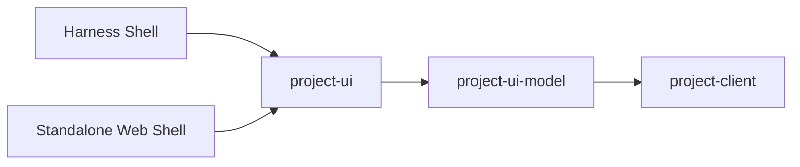

# DeepSeek Harness 项目交付工作台：界面与交互规范 v0.1

> 状态：视觉与交互设计收敛  
> 日期：2026-09-17  
> 适用范围：DeepSeek Harness 内嵌前端与独立 Web 前端  
> 关联文档：`deepseek-harness-project-delivery-prd-v0.4.md`

---

## 1. 目的

本文档把已经确认的视觉稿收敛成可实现的界面规范。

它不定义新的业务模型，而是回答：

1. 哪些页面是一等业务视图；
2. 哪些只是同一领域对象的不同投影；
3. 哪些组件必须共享；
4. Loading、Stale、Permission Denied、Provider Offline 等非 Happy Path 如何统一处理；
5. Harness 内嵌与独立 Web 如何共享同一套业务 UI。

核心原则：

> **Planning-first，Delivery-aware；Attention over dashboard；Capability-driven；Explicit over inferred。**

---

## 2. 外壳与导航

### 2.1 两种外壳

业务 UI 只能实现一套。



Harness Shell 负责：

- Harness Workspace 导航；
- Slot；
- Theme / Token；
- 原生 Sessions / Agents / Terminal / Git 入口。

Standalone Web Shell 负责：

- Projects Home；
- Recent；
- Account；
- Connections；
- Web Router。

### 2.2 项目内部导航

固定骨架：

- 概览
- 规划
- 工程交付
- Analytics
- 设置

“规划”根据工作方式预设显示不同子视图。

| 视图 | Scrum | Kanban | Project | Basic |
|---|---:|---:|---:|---:|
| 工作项 | ✓ | ✓ | ✓ | 默认 |
| Backlog | 默认 | 可选 | 可选 | 可选 |
| Sprint | 默认 | 隐藏 | 可选 | 隐藏 |
| 看板 | ✓ | 默认 | 可选 | 可选 |
| Roadmap | ✓ | 可选 | 默认 | 可选 |
| Milestones | ✓ | 可选 | 默认 | 可选 |
| 工程交付 | ✓ | ✓ | ✓ | ✓ |
| Analytics | ✓ | ✓ | ✓ | 可选 |

隐藏只改变默认导航，不删除数据。

---

## 3. 页面目录

| 页面 | 产品角色 | 主行动 | 权威信息 | 派生信息 |
|---|---|---|---|---|
| Projects Home | 多项目入口 | 打开项目 | 项目连接 | 需关注 |
| 创建项目工作区 | 接入配置 | 创建工作区 | 连接配置 | 能力摘要 |
| 概览 | 项目注意力中心 | 处理异常项 | 各域事实 | Attention |
| 工作项列表 | 精确规划编辑 | 编辑 / 批量操作 | Planning | 工程摘要 |
| Backlog | Scrum 排序与计划 | 加入 Sprint | Planning | Readiness |
| Sprint | 当前迭代执行面 | 查看 / 调整范围 | Planning | Scope Delta |
| Board | 状态流转视图 | 修改 Planning Status | Planning | 工程 Footer |
| Kanban | 持续流动视图 | Pull / 处理阻塞 | Planning | WIP / Aging |
| Roadmap | 时间规划 | 调整日期 / 依赖 | Planning | Progress |
| Milestones | 发布准备 | 处理阻塞 Gate | Planning + Delivery | Readiness |
| 工程交付 | 工程链路总览 | 打开问题项 | Dev / Delivery | Gate Summary |
| WorkItem Detail | 全局统一详情 | 开始工作 / 编辑 | 多域事实 | Attention |
| Start Work | 规划→工程桥 | 创建 ExecutionContext | 用户输入 | 默认值 |
| ExecutionContext | 研发执行面 | 完成实现 / 建 PR | Git / Harness | Handoff Readiness |
| Deployments | 只读交付 | 打开原生平台 | Delivery | Health Summary |
| Analytics | 判断与复盘 | 切换分析维度 | 历史事实 | 聚合指标 |
| Settings | 项目配置 | 修改连接与策略 | Local Config | Capability |
| Work Method | 体验预设 | 保存工作方式 | Local Config | 导航预览 |
| WorkItem Editor | 规划编辑 | 创建 / 保存 | Planning | 写入预览 |
| Relations | 关系管理 | 建立显式关系 | Planning / Core | 环检测 |
| Diagnostics | 同步诊断 | 确认候选关系 | Provider Health | Candidate |
| Activity | 来源追踪 | 查看事件 | 多域事件 | Derived Event |
| Access | 权限解释 | 打开源平台 / 修复连接 | Capability / Permission | Effective Access |

---

## 4. 共享组件

实现时优先构建以下共享组件，而不是按页面复制。

### 4.1 WorkItem 组件

- `WorkItemKey`
- `WorkItemTitle`
- `PlanningStatusBadge`
- `PriorityBadge`
- `Assignee`
- `IterationBadge`
- `MilestoneBadge`
- `EngineeringSummary`
- `AttentionIndicator`

### 4.2 工程组件

- `ExecutionContextSummary`
- `BranchRef`
- `CommitRef`
- `ChangeRequestRef`
- `GateBadge`
- `PipelineSummary`
- `DeploymentSummary`
- `LineageStrip`

### 4.3 来源与系统状态

- `SourceBadge`
- `CapabilityBadge`
- `FreshnessBadge`
- `DerivedBadge`
- `ProvenancePanel`
- `DegradedBanner`
- `WriteState`
- `ExternalLinkAction`

### 4.4 页面骨架

- `ProjectHeader`
- `ProjectNavigation`
- `FilterBar`
- `DataTable`
- `BoardColumn`
- `RoadmapTrack`
- `DetailDrawer`
- `EmptyState`
- `SkeletonState`
- `ErrorState`
- `PermissionState`

---

## 5. 统一工作项详情

任何工作项点击行为都进入同一个 `WorkItemDetailDrawer`。

禁止出现：

- `BoardWorkItemDetail`
- `RoadmapWorkItemDetail`
- `DeliveryWorkItemDetail`

三个独立实现。

Drawer 内部可复用：

1. Planning Section
2. Relations Section
3. Execution Contexts Section
4. Change Requests Section
5. Gates Section
6. Deployments Section
7. Activity / Provenance Section

详情抽屉的路由应可 Deep Link，例如：

`/projects/:projectId/items/:itemId`

---

## 6. 写操作规范

### 6.1 外部规划字段

写入过程：

```text
Idle → Saving → Provider Confirmed
              ↘ Failed
              ↘ Conflict
```

不建议在 Provider 确认前把本地值标记为最终成功。

### 6.2 Start Work

必须由用户显式发起。

立即建立：

```text
WorkItem
  ↓
ExecutionContext
  ↓
Worktree
  ↓
Branch
```

如果 Harness Session 创建失败，ExecutionContext 仍可存在，并降级为人工执行。

### 6.3 关系写入

计划依赖：

- 显式创建；
- 创建前环检测；
- 不使用 LLM。

工程语义：

- `references`
- `contributes_to`
- `resolves`

必须明确选择语义。

### 6.4 派生状态

以下不允许作为外部字段写入：

- Attention
- Ready to Merge
- Handoff Ready
- Release Readiness
- Multi-repo incomplete
- Stale
- Capability degraded

---

## 7. 全局状态模式

### 7.1 Empty

每个空状态只给一个主要行动。

示例：

- 没有项目 → 创建项目工作区
- 没有仓库 → 连接代码仓库
- 没有 ExecutionContext → 开始工作
- 没有 CI → 连接交付来源
- 没有 Deployment → 显示“尚无部署事实”，不伪造 Not Deployed

### 7.2 Loading

首次页面加载：

- Skeleton；
- 不显示全屏 Spinner。

局部刷新：

- 保留 Last Known State；
- 局部显示 Syncing。

### 7.3 Stale

显示：

- Stale；
- Last updated；
- Provider；
- 打开源平台。

### 7.4 Provider Offline

原则：

- 局部失败；
- 能读缓存则只读；
- 写操作禁用；
- 其他能力继续可用。

### 7.5 Permission Denied

Disabled 不是解释。

必须告诉用户：

- 哪个能力被禁止；
- 哪一层禁止；
- 当前还能做什么；
- 是否能在源平台完成。

### 7.6 Conflict

外部字段编辑冲突时：

- 显示远端当前值；
- 保留用户输入；
- 允许 Refresh / Reapply；
- 不直接 Last Write Wins。

---

## 8. Capability 驱动界面

UI 不写：

```text
if provider == github
```

而写：

```text
if capabilities.planning.writeStatus
```

示例：

| Capability | 完整 | 部分 | 不可用 |
|---|---|---|---|
| writeStatus | 下拉可编辑 | 只读 | 隐藏编辑动作 |
| startDate | Roadmap Start+Target | Target-only | 不显示日期轨 |
| createPR | 本地创建 | 只读 PR | 打开原生平台 |
| readCI | 实时 Gate | Last Known | Unknown + 外链 |
| deploy | 不在 MVP | 不在 MVP | 始终外链 |

---

## 9. 视觉密度与布局

### 9.1 桌面端

主要目标宽度：

- 1440 px：最佳体验；
- 1200 px：完整主视图；
- 1024 px：详情切为 Overlay。

### 9.2 密集视图

允许局部横向滚动：

- Board；
- Roadmap；
- Delivery；
- Capability Matrix。

不允许：

- 整个页面横向滚动；
- 不同 Roadmap Row 的绝对定位元素互相覆盖。

### 9.3 右侧详情

桌面宽屏：

- 主区 + 300–340 px Detail。

窄屏：

- Overlay Drawer。

---

## 10. 状态色与可访问性

状态视觉必须同时包含文字或图标。

推荐语义：

- 成功 / Healthy / Passed
- 进行中 / Running / Pending
- 需关注 / Warning / Stale
- 失败 / Blocked / Failed

最低要求：

- 主要动作高度 ≥ 44 px；
- Focus Visible；
- 表单 Label；
- 键盘可达；
- 状态不只靠颜色；
- Drawer / Dialog 有可访问标题；
- 图表提供文本摘要。

---

## 11. 术语规范

用户界面优先中文。

| 架构术语 | 用户界面 |
|---|---|
| Provider | 数据来源 / 连接 |
| Capability | 能力 |
| Source of Truth | 项目规划事实源 |
| PlanningItem | 项目条目 |
| WorkItem | 工作项 |
| ExecutionContext | 执行上下文 |
| ChangeRequest | 变更请求 / PR / MR |
| Delivery Graph | 交付谱系 |
| Gate | 门禁 |
| Provenance | 来源追踪 |
| Preset | 工作方式 |

仅在开发者或高级诊断界面中保留 Provider、Capability、Provenance 等英文术语。

---

## 12. 页面之间的统一规则

- 点击工作项 → 同一 WorkItem Detail。
- 点击 PR / CI / Deployment → 优先本地详情；始终保留源平台入口。
- Start Work → 永远显式。
- 创建 WorkItem → 不自动 Start Work。
- Agent 完成 → 不自动 Done。
- CI Passed → 不自动 Done。
- PR Merged → 是否影响 Planning 由 Status Policy 决定。
- Deployment → MVP 只读。
- Candidate Relation → 必须确认。
- Refresh → 只刷新投影，不改变事实源。
- Work Method 切换 → 不删除数据。
- Capability 缺失 → 局部退化，不让整个 Workspace 失败。

---

## 13. 实现映射

建议共享前端包：

```text
project-ui
├── project-shell
├── navigation
├── work-item
├── planning
│   ├── list
│   ├── backlog
│   ├── sprint
│   ├── board
│   ├── roadmap
│   └── milestones
├── delivery
├── execution
├── analytics
├── settings
├── diagnostics
└── shared
    ├── badges
    ├── provenance
    ├── capability
    ├── empty-state
    ├── error-state
    └── detail-drawer
```

`project-ui-harness` 和 `project-web` 只能包装 `project-ui`，不得复制上述业务组件。

---

## 14. 设计完成标准

进入实现前，本轮视觉设计认为已经收敛。

后续若没有领域模型变化，不应继续新增一级页面。

实现阶段的 UI Review 重点改为：

- 是否遵守统一组件；
- 是否正确处理 Capability；
- 是否覆盖 Empty / Loading / Stale / Error；
- 是否保留事实源边界；
- 是否避免 Planning / Delivery 状态混用；
- Harness 与 Web 是否复用同一业务组件；
- Roadmap / Board / Delivery 是否在窄宽度下不重叠；
- 所有外部写入是否有 Saving / Failure / Conflict 状态。

