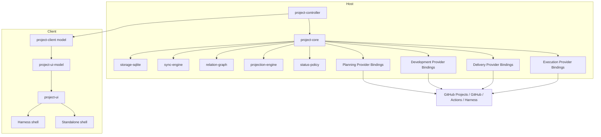
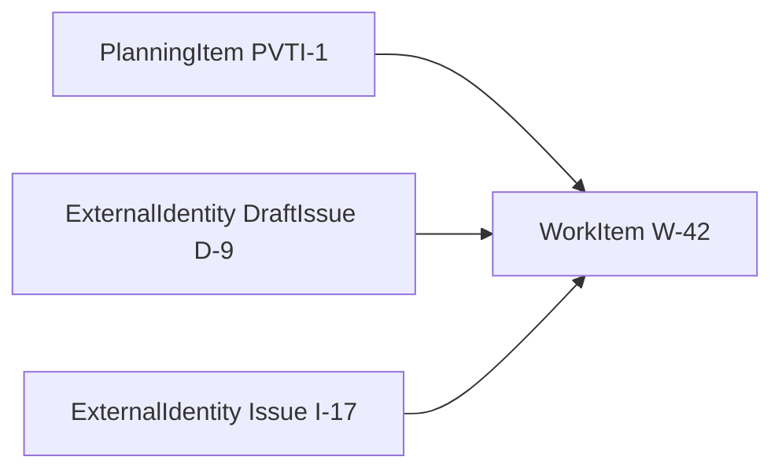
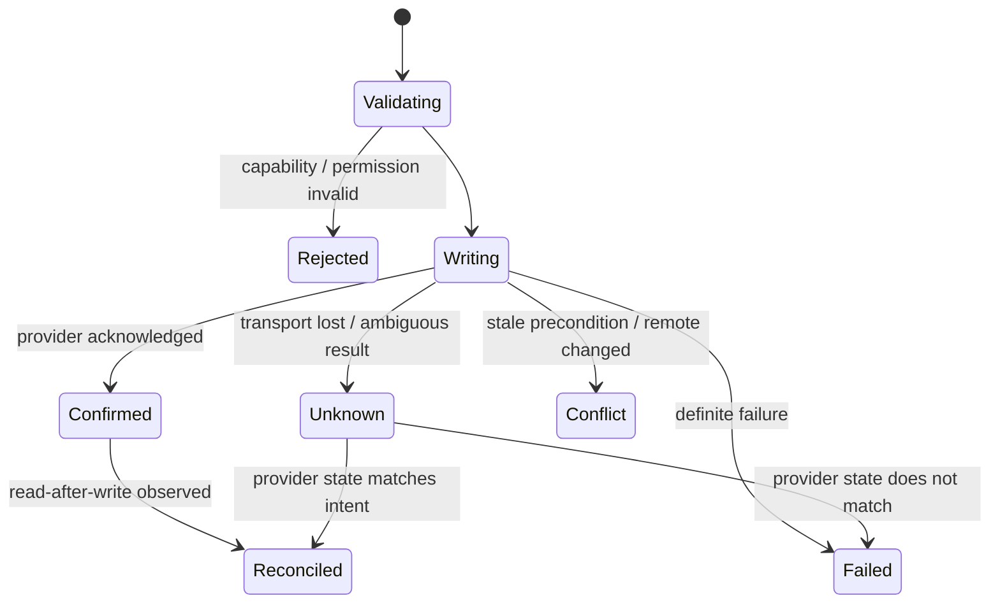
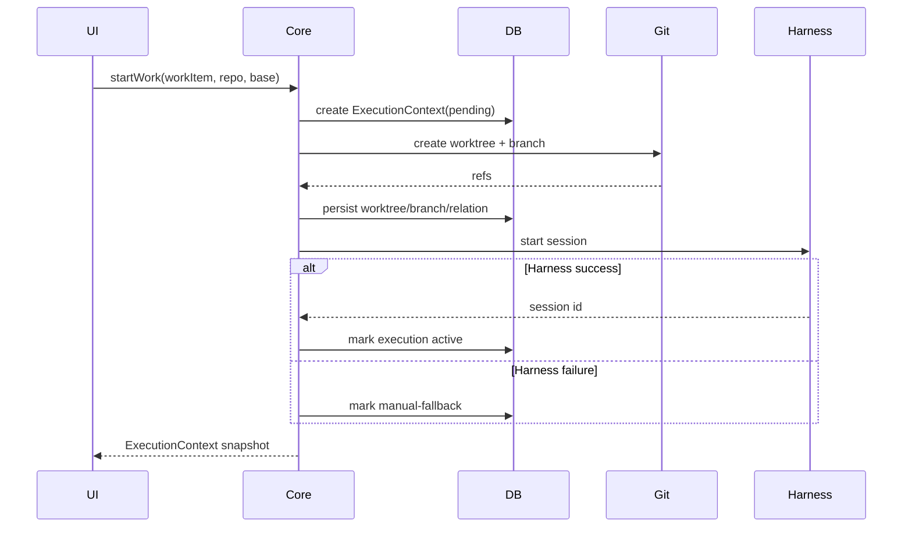

# DeepSeek Harness 项目交付工作台：Engineering Design v0.1

> 日期：2026-09-17  
> 状态：工程设计候选，等待 Identity Spike 与仓库级验证后冻结  
> 关联：PRD v0.4、UI Spec v0.1

## 1. TL;DR

当前产品设计已经足够稳定。工程实现的第一原则不是“把 24 个页面逐个做出来”，而是先建立一个不会被 GitHub / Jira / Git / CI 差异击穿的 Host-side control plane。

本设计做出六个关键选择：

1. `project-core` 运行在 Host 侧，拥有本地权威状态、持久化、mutation 顺序、访问策略和投影；前端只消费稳定 Client Model。
2. 外部平台凭据与“在某个工作空间中扮演的能力”分离：`ConnectorAccount` 管平台身份与凭据，`ProviderBinding` 管 Planning / Development / Delivery / Execution 角色。
3. 所有外部对象先进入统一 `ExternalIdentity` 注册表，再绑定到稳定的内部实体 ID；这样 Draft → Issue、同一 Issue 多 Project membership、PR-backed Project Item 都不会造成身份坍缩。
4. SQLite 保存当前事实缓存、关系、执行上下文、同步状态、mutation 记录和活动投影；不把系统设计成 Event Sourcing。
5. Webhook 是低延迟加速器，周期性 reconciliation 才是同步正确性的兜底。GitHub Projects webhook 仍存在范围与预览限制，因此不能成为唯一同步机制。
6. 外部写入遵循 “Validate → Write Provider → Confirm/Reconcile → Commit projection”。Provider 未确认之前，本地不得把新值标记为权威成功。

这套设计优先保护四个不可退让的不变量：

- 一个 Project Workspace 同一时刻只有一个 Planning Source of Truth；
- Planning State 与 Engineering State 正交；
- 关系显式优先，LLM 不进入控制路径；
- 外部写失败或同步滞后时，本地缓存不得篡位成为外部事实源。

## 2. 当前事实、硬约束与假设

### 2.1 已确认事实

产品层已经确认：

- Workspace 可连接一个 Planning Provider、多 Development / Delivery Provider；
- `PlanningItem` 是 Project membership，不等同于 Issue / PR / Draft；
- `WorkItem` 主要对应 Issue、Draft、Jira Issue、Local Task；
- `ChangeRequest` 对应 PR / MR，始终保持唯一身份；
- `ExecutionContext` 是 Planning → Engineering 的显式桥；
- Delivery / Attention / Readiness 都是派生投影；
- UI 依赖 Capability，而不是 Provider 名称；
- 首个版本以 GitHub Projects + GitHub + Local Git + GitHub Actions + Harness 为主。

GitHub 当前 GraphQL schema 将 ProjectV2Item 的内容类型定义为 DraftIssue、Issue 或 PullRequest；GitHub 同时提供 `addProjectV2DraftIssue` 与 `addProjectV2ItemById` mutation。这直接支持 PlanningItem 与内容对象分离的模型。

DeepSeek Harness 当前 Web Client 架构明确采用 Host authoritative state → typed Remote API → React-free Client Model → UI adapter / Slots → React 的所有权方向。本项目沿用这一方向。

### 2.2 硬约束

- 不建立 GitHub Projects / Jira / Local 的多主实时同步。
- 不在 React Store 中维护业务权威状态。
- 不通过 LLM 推断 `resolves`、`contributes_to` 或项目状态。
- 不要求 GitHub webhook 永久在线或覆盖所有 Project 类型。
- 不把 GitHub Actions / Deployment 的只读事实提升为 Planning 状态。
- 不把认证 secret 明文放进 Project SQLite。

### 2.3 当前假设

这些假设需要在实现阶段验证：

- DeepSeek Harness 仓库中可以新增一个 paired Host/Client controller，而不破坏现有 Web Client 包边界；
- MVP 可以使用 SQLite 单进程写模型，不需要分布式数据库；
- 一个项目典型规模可以通过本地 SQLite + 增量同步流畅处理，不需要搜索集群；
- GitHub Projects 的字段映射可由 Workspace 配置解决，而不是写死 Status / Priority 字段名；
- Provider 返回的 External ID 足以构建稳定自然键；若某平台缺少全局稳定 ID，则 Provider 自己负责合成 scope-aware external key。

## 3. 目标运行架构



依赖方向必须保持：

```text
Provider implementation
        ↓
Capability contract
        ↓
project-core
        ↓
project-controller wire contract
        ↓
project-client
        ↓
project-ui-model
        ↓
project-ui
        ↓
shell
```

反向依赖禁止出现。例如：

- `project-core` 不能 import GitHub Provider implementation；
- `project-ui` 不能调用 GitHub API；
- `project-client` 不能 import React；
- Provider 之间不能互相直接调用。

## 4. ConnectorAccount 与 ProviderBinding

如果把“GitHub 账号连接”和“GitHub 在 Workspace 中扮演 Planning/Development/Delivery 的角色”混为一个对象，会出现两个问题：

- 同一 GitHub App installation 被重复配置与授权；
- Provider 角色变化会错误影响 credential identity。

因此拆成两层。

### 4.1 ConnectorAccount

表示一个可认证的外部平台连接。

示例：

```text
github-installation: 123456
deepseek-harness: local-host
local-git: machine-local
```

核心字段：

- provider family；
- account / installation identity；
- display name；
- opaque `secret_ref`；
- connection state。

`secret_ref` 只是一把指向 Harness secret / credential service 的句柄。Project SQLite 不保存 token。

### 4.2 ProviderBinding

表示某个 ConnectorAccount 在某个 Workspace 中承担什么能力域。

示例：

```text
Workspace Runtime Platform
  Planning    -> planning.github-projects -> GitHub installation 123456
  Development -> development.github       -> GitHub installation 123456
  Development -> development.local-git    -> local machine
  Delivery    -> delivery.github-actions  -> GitHub installation 123456
  Execution   -> execution.harness        -> local Harness host
```

ProviderBinding 拥有：

- Workspace；
- domain；
- implementation key；
- ConnectorAccount；
- Provider-specific config；
- capability snapshot；
- permission snapshot；
- health / freshness；
- 是否默认。

SQLite 使用 partial unique index 确保一个 Workspace 只有一个启用的 Planning Binding。

## 5. 外部身份模型

### 5.1 ExternalIdentity

`ExternalIdentity` 是 Provider 世界中的对象自然键。

建议唯一键：

```text
(connector_account_id, object_kind, external_id)
```

例如：

```text
github / issue / I_kwDO...
github / pull_request / PR_kwDO...
github / project_v2_item / PVTI_lADO...
github / project_v2_draft / PVTD...
github / workflow_run / 6812
```

### 5.2 内部 Entity ID

系统内部所有可关联对象使用稳定的 opaque UUID/ULID：

- WorkItem；
- PlanningItem；
- ChangeRequest；
- Repository；
- ExecutionContext；
- Worktree；
- Branch；
- Commit；
- PipelineRun；
- Deployment；
- AgentRun。

`ExternalIdentity` 可以随着对象生命周期变化而增加或退役，但内部 Entity ID 不变化。

最重要的例子是 Draft → Issue：



转换后：

- `W-42` 不变；
- Draft external identity 标记为 historical alias；
- Issue external identity 成为 primary；
- PlanningItem membership 根据 Provider 返回结果更新，但 WorkItem 不被删除重建。

### 5.3 PlanningItem 的内容引用

PlanningItem 是项目成员关系，因此内容必须是 typed reference：

```text
content_kind = work_item | change_request | redacted
content_entity_id = internal entity id
```

对于 GitHub Project 中的 PR：

```text
ProjectV2Item
  → PlanningItem
  → content_kind = change_request
  → existing ChangeRequest
```

绝不创建第二个 WorkItem。


### 5.4 Workspace-scoped local projection

MVP 的用户语义是：

```text
一个 Project Workspace ↔ 一个 Planning Project
```

因此内部 `WorkItem` / `ChangeRequest` projection 以 Workspace 为作用域。若同一个 GitHub Issue 同时出现在两个不同 Project Workspace：

- `ExternalIdentity` 仍然只有一个；
- 两个 Workspace 可以各自拥有一个本地 WorkItem projection；
- 每个 projection 拥有自己的 PlanningItem、ExecutionContext、Attention 与本地关系；
- 不在 MVP 引入跨 Workspace 的 global WorkItem aggregate。

这不是身份坍缩，因为稳定的外部内容身份仍由 `ExternalIdentity` 唯一表示。

这样做的原因是 Project Workspace 本身就是本地控制与执行边界。跨 Workspace 共享一个可变内部 WorkItem 会把 ExecutionContext、状态策略、关系和权限耦合起来，却没有 MVP 用户价值。

如果未来产品明确支持“一个 Project Workspace 下挂多个 Planning Project”，可以在不改变 ExternalIdentity 的前提下把内容 projection 上提为 Workspace-global entity。


## 6. SQLite 设计原则

SQLite v1 不是“把外部系统完整复制下来”，而是保存五类数据：

1. Workspace 本地配置；
2. 外部对象 identity 与最近观测事实；
3. 本地控制实体，例如 ExecutionContext、关系与人工审批；
4. Sync / mutation 的可靠性元数据；
5. UI 需要的 activity / provenance projection。

不保存：

- Git 历史全量对象；
- CI 全量日志；
- GitHub Project 的所有任意字段版本历史；
- Secret；
- 外部系统可随时重新获取的大体积 payload。

`schema-v0.1.sql` 是本设计的可执行 schema。

## 7. 同步模型

### 7.1 Bootstrap

首次连接 Planning Source 时：

1. 读取 Project；
2. 读取字段定义与 field mapping；
3. 分页读取 PlanningItem；
4. 对每个 item 解析 content union；
5. upsert ExternalIdentity；
6. upsert WorkItem / ChangeRequest；
7. upsert PlanningItem membership 与项目字段；
8. 计算 normalized status；
9. 写入 sync cursor / freshness；
10. 发布 Workspace Snapshot changed。

Bootstrap 必须允许中断与重试。每一页 upsert 是幂等的。

### 7.2 增量同步

增量来源可以是：

- Provider webhook；
- Provider event stream；
- polling；
- user refresh；
- periodic reconciliation。

统一进入：

```text
Provider observation
  → dedupe
  → normalize
  → transactional upsert
  → relation update
  → projection recompute
  → client delta
```

### 7.3 Webhook 不是 correctness dependency

GitHub 当前提供 `projects_v2_item` webhook，但 Projects webhook 仍处于 public preview，且文档当前将该事件的可用范围描述为 organization-level projects。

因此 MVP 的正确性模型必须是：

```text
Webhook = low-latency hint
Periodic reconciliation = correctness backstop
Manual refresh = user recovery path
```

任何 Provider 都必须允许“没有 webhook 也最终正确”。

### 7.4 Dedupe 与顺序

每条 ProviderEvent 保存：

- binding；
- dedupe key；
- external event id；
- event time；
- received time；
- payload hash；
- processing state。

事件处理需要同时应对：

- duplicate；
- out-of-order；
- delayed；
- missing event。

处理原则：

- duplicate：唯一键去重；
- out-of-order：比较 Provider source version / updated_at；旧观察不得覆盖新观察；
- missing event：reconciliation 修正；
- 无版本字段：以 read-after-event 的 Provider 当前状态为准，而不是相信 webhook payload 一定完整。

## 8. 外部写入模型

### 8.1 状态机



### 8.2 本地 UI 行为

UI 可以立即显示：

```text
Saving…
```

但不能在 Provider ack 前显示：

```text
Saved
```

失败时：

- 保留 Last Known Authoritative Value；
- 展示 write error；
- 用户可以重试或打开源平台。

Conflict 时：

- 展示 remote current value；
- 展示用户 attempted value；
- 允许 Reload Remote；
- 允许用户重新应用。

### 8.3 MutationAttempt

每次外部写操作记录：

- command；
- target；
- ProviderBinding；
- local idempotency key；
- expected source version；
- request summary；
- result / error；
- provider request id（若有）；
- state。

`clientMutationId` 之类的 Provider 字段可用于 trace，但不能未经验证就假定 Provider 提供 exactly-once semantics。

对于“创建 Issue / PR”这类可能产生重复外部对象的操作，如果响应丢失且结果不确定：

- 不自动无限重试；
- mutation 进入 `unknown`；
- 先 reconciliation；
- 确认未创建后再允许重试。

## 9. 关系图

所有可关联的内部对象先拥有 `entity` 注册记录。

`artifact_relation` 使用内部 Entity ID，因此能有数据库 FK。

关系分两类：

### 9.1 业务语义边

- `references`
- `contributes_to`
- `resolves`
- `parent_of`
- `blocks`

保存 provenance：

- provider_native；
- harness_created；
- user_manual；
- deterministic_confirmed。

### 9.2 系统事实边

- `contains`
- `source_branch`
- `includes_commit`
- `verifies`
- `builds`
- `deploys`
- `runs_for`

这些边通常由 Provider observation 或 Start Work 流程生成，不需要用户选择业务语义。

### 9.3 CandidateRelation

确定性规则发现但尚未确认的关系必须进入独立 candidate 表，而不是直接写 `artifact_relation`。

例如：

```text
branch = feat/DEV-123-runtime
exact work item key = DEV-123
```

可以生成 candidate：

```text
WorkItem DEV-123 --contributes_to?--> Branch
```

用户确认后才转为正式关系，provenance = deterministic_confirmed。

## 10. Start Work 事务边界

Start Work 跨越数据库、本地 Git 和 Harness，不可能形成单个 ACID 事务。

因此采用 Saga-style compensating flow，但保持步骤最少。



恢复规则：

- DB 建立失败：不做 Git mutation；
- Git 创建失败：ExecutionContext 标记 failed，保留诊断，不启动 Harness；
- Harness 启动失败：不删除工作树和分支，降级成人工执行；
- 重试 Start Work 时必须先检查是否已存在同一 WorkItem + Repo 的 active context，避免重复 worktree。

## 11. Project Core API 分层

Core API 分成 Query 与 Command。

Query 只返回：

- authoritative snapshot；
- cached external facts；
- derived projection；
- capability / freshness metadata。

Command 明确区分：

- Local command；
- Provider write command；
- Cross-domain orchestration command。

禁止一个普通 Query 隐式触发外部 mutation。

## 12. Client Model

`project-client` 是 React-free 的 identity-stable model。

建议对外提供：

```text
ClientProjects
  └─ ProjectWorkspace
      ├─ snapshot
      ├─ planningItems
      ├─ workItems
      ├─ delivery
      ├─ capabilities
      ├─ syncState
      └─ commands
```

Client 必须处理：

- snapshot baseline + later stream delta；
- reconnect；
- unary response 与 stream race；
- object identity stability；
- stale / reconnecting 状态。

UI 不直接缓存第二份 Provider object。

## 13. Capability 与 Permission

Capability 回答：

```text
这个 Provider 实现理论上会不会做？
```

Permission 回答：

```text
这个 ConnectorAccount 当前有没有权做？
```

Policy 回答：

```text
这个 Workspace 是否允许这么做？
```

最终 EffectiveAccess：

```text
EffectiveAccess = Capability ∩ Permission ∩ Policy
```

所有 Command 在 Core 再次校验。UI 隐藏按钮不是安全边界。

统一结果：

- available；
- read_only；
- unavailable；
- degraded。

## 14. 错误模型

Core 对 UI 暴露稳定错误码，而不是把 GitHub / Jira 原始错误直接穿透。

首个版本至少包括：

- `INVALID_ARGUMENT`
- `NOT_FOUND`
- `NOT_SUPPORTED`
- `PERMISSION_DENIED`
- `CONFLICT`
- `STALE_WRITE`
- `RATE_LIMITED`
- `UNAVAILABLE`
- `AMBIGUOUS_EXTERNAL_RESULT`
- `LOCAL_GIT_FAILURE`
- `EXECUTION_FAILURE`

每个错误包含：

```text
code
message
retryable
provider
externalRequestId?
currentValue?
attemptedValue?
recoveryAction?
```

## 15. 安全与信任边界

### 15.1 Secret

Project SQLite 只保存 `secret_ref`。

不保存：

- GitHub token；
- Jira token；
- Harness credential；
- SSH private key。

### 15.2 Local Git

- path 必须 canonicalize；
- worktree 必须位于允许 workspace root；
- Git 命令使用 argv / library API，不拼接 shell；
- branch name 在 Provider 层校验；
- 删除 worktree 是显式操作，默认不自动清理有未提交修改的目录。

### 15.3 外部写

- 每次 mutation 记录 actor；
- 每次 mutation 记录 target ProviderBinding；
- 关键写操作提供 External Link 便于用户核对；
- UI 不隐藏 Provider 权限错误。

## 16. Observability

最低可观察指标：

- provider sync duration；
- provider last successful sync；
- stale age；
- event duplicate count；
- event processing failure；
- mutation success / failure / conflict / unknown；
- reconciliation correction count；
- Start Work failure stage；
- projection recompute latency；
- client reconnect count。

日志必须包含：

- workspace_id；
- binding_id；
- internal entity id；
- external id（允许时）；
- mutation / event correlation id。

禁止记录 Secret。

## 17. 性能策略

MVP 不引入 Redis、消息队列、搜索集群或独立事件总线。

优先：

- SQLite WAL；
- 必要索引；
- Provider 分页；
- 增量 projection；
- bounded polling；
- Client delta stream。

任何新增基础设施必须由真实测量证明当前单机模型不足。

## 18. 第一工程验证 Gate E1

实现大规模 UI 前先完成一个独立的 GitHub identity/sync spike。

必须验证：

1. Issue-backed ProjectV2Item；
2. Draft-backed ProjectV2Item；
3. PR-backed ProjectV2Item；
4. 同一 Issue 同时加入两个 Project；
5. Draft → Issue conversion；
6. Status / Iteration field write；
7. item reorder；
8. webhook 可用性与缺失场景；
9. duplicate observation；
10. ambiguous create response 的恢复策略。

只有当这些行为能映射到 `schema-v0.1.sql`，且不需要破坏内部 identity，才冻结 schema v1。

## 19. 后续仓库级落地

拿到实际 DeepSeek Harness 工作树后，下一步不是重新设计，而是做 Repository Reconnaissance：

- 读取 root `AGENTS.md`；
- 读取 root `PLANS.md`（若存在）；
- 确认 Host controller、Client model、Storage、Slot 的实际 package naming；
- 把本设计中的概念包映射到真实 repository paths；
- 创建一个 repository-native ExecPlan；
- 从 Gate E1 spike 开始实现。

如果实际仓库边界与本文不同，以 repository evidence 为准，但任何修改七条产品架构不变量的决定必须回到 PRD / ADR 层重新评审。

## 20. 官方接口事实校准

本设计在 2026-09-17 校准了以下官方资料：

- GitHub GraphQL Projects schema：ProjectV2Item content union 当前包含 DraftIssue、Issue、PullRequest；ProjectV2ItemType 同样区分 DRAFT_ISSUE、ISSUE、PULL_REQUEST、REDACTED。
- GitHub Projects API：支持 `addProjectV2DraftIssue`、`addProjectV2ItemById`、`convertProjectV2DraftIssueItemToIssue`、`updateProjectV2ItemFieldValue`。
- GitHub Projects webhook：存在 `projects_v2_item`，但当前文档标为 public preview，并描述为 organization-level project 事件。
- GitHub Actions REST：workflow runs 可按 branch、head SHA、status 等过滤；MVP 只使用读取能力。
- DeepSeek Harness Web Client：Host 拥有权威状态、mutation 顺序、访问策略和 stream；Client Model 保持 React-free identity-stable mirror；Presentation 不接收 transport 或其他 feature implementation。
